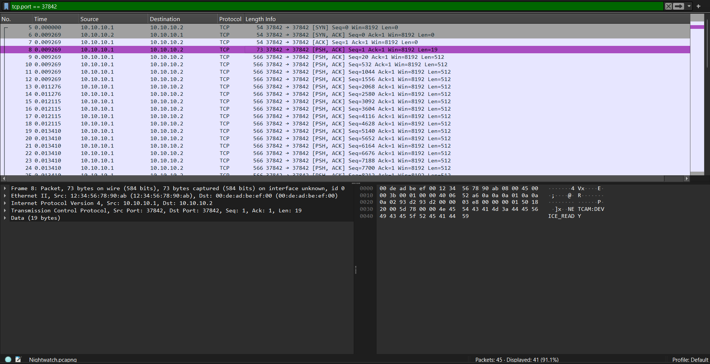
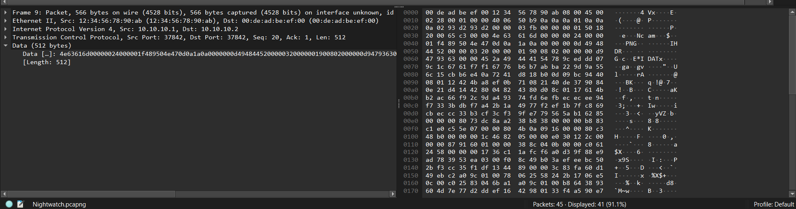
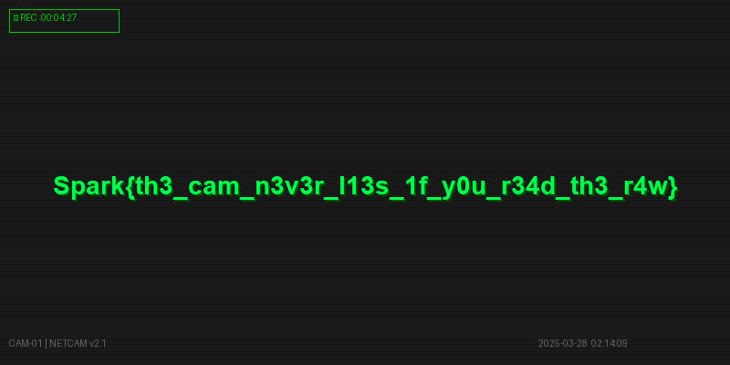

# NightWatch — Forensics Challenge Walkthrough

---

## Description

> A suspicious IP camera was detected on the internal network during the night of Ramadan. By the time anyone noticed, it had already transmitted something. A packet capture was running. That is all you have. Find out what the camera was sending.

## Overview

This challenge provides a single file:
- `Nightwatch.pcapng` — a packet capture of suspicious network traffic

The goal is to analyze the capture, identify the custom NETCAM protocol stream, extract the fragmented PNG image data from the packets, reassemble it, and read the flag from the image.

---

## Walkthrough

Open `Nightwatch.pcapng` in Wireshark. The capture contains a mix of noise packets — ARP requests, TCP handshakes to unrelated ports — and a suspicious TCP stream between `10.10.10.1` and `10.10.10.2` on port `37842`. Filter by that stream using `tcp.port == 37842` to isolate the relevant traffic.



After the TCP three-way handshake (SYN, SYN-ACK, ACK), the first data packet contains the ASCII string NETCAM:DEVICE_READY, signaling the start of a custom camera streaming session. The following packets each begin with a 4-byte magic value `4E 63 61 6D` which is `Ncam` in ASCII — this is the custom NETCAM protocol header. Each packet payload has a fixed 12-byte header structured as magic (4 bytes), chunk index (2 bytes), total chunks (2 bytes), and payload length (4 bytes). After stripping this 12-byte header, the remaining bytes are raw PNG data. The last packet contains `NETCAM:STREAM_END`.



To extract the flag, write a Python script using scapy that iterates over all packets, identifies those with the `Ncam` magic, strips the 12-byte header from each, and concatenates the remaining data. Use the PNG magic bytes `89 50 4E 47` to find the start and the PNG footer `49 45 4E 44 AE 42 60 82` to find the end, then save the result as a `.png` file.

```python
from scapy.all import rdpcap, Raw

PNG_HEADER = b'\x89PNG\r\n\x1a\n'
PNG_FOOTER = b'\x49\x45\x4E\x44\xAE\x42\x60\x82'

packets = rdpcap("Nightwatch.pcapng")
png_data = b''
in_png = False

for packet in packets:
    if not packet.haslayer(Raw):
        continue
    payload = bytes(packet[Raw])
    if payload[:4] == b'Ncam':
        payload = payload[12:]
    if not in_png:
        if PNG_HEADER in payload:
            png_data += payload[payload.find(PNG_HEADER):]
            in_png = True
    else:
        png_data += payload
        if PNG_FOOTER in png_data:
            png_data = png_data[:png_data.find(PNG_FOOTER) + 8]
            break

with open("flag.png", "wb") as f:
    f.write(png_data)
```

Open `flag.png` to reveal the flag!



**Flag:** `Spark{th3_cam_n3v3r_l13s_1f_y0u_r34d_th3_r4w}`
